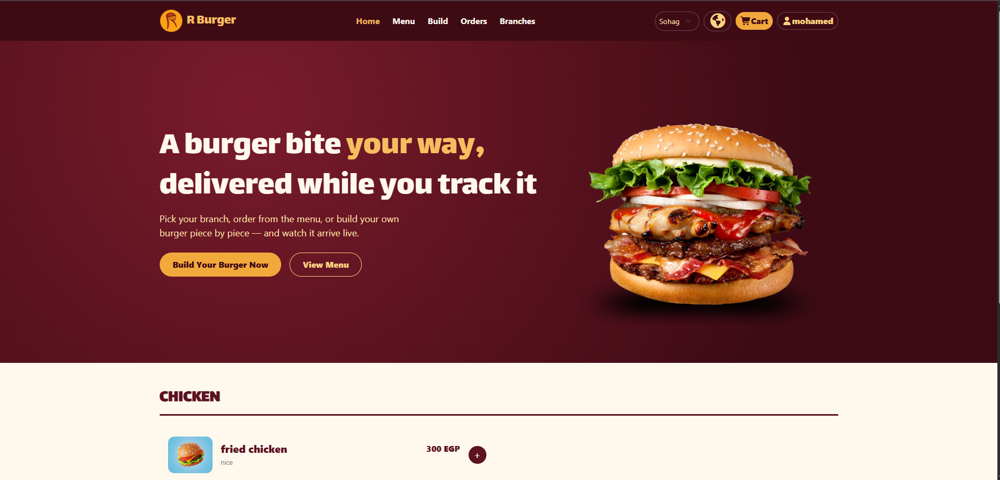
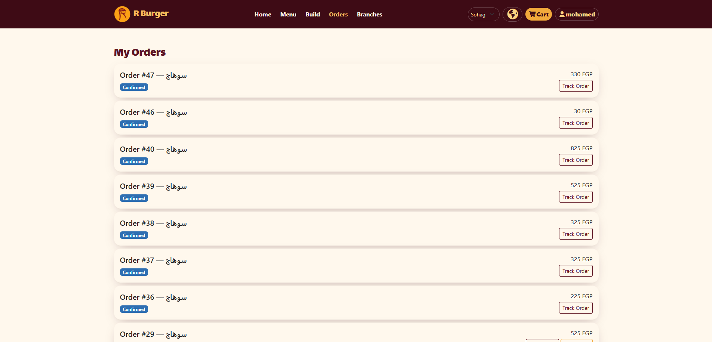
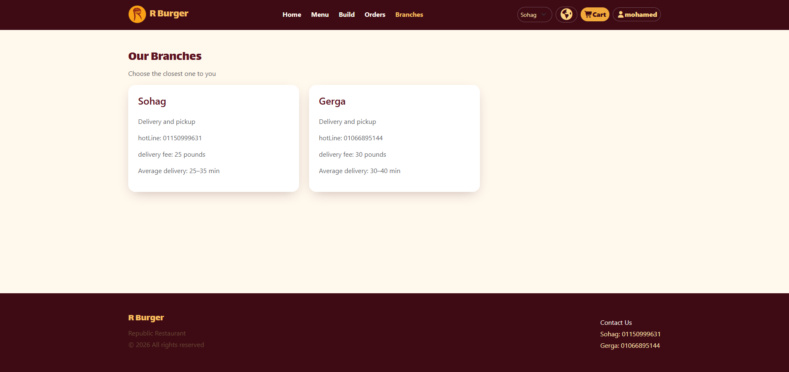
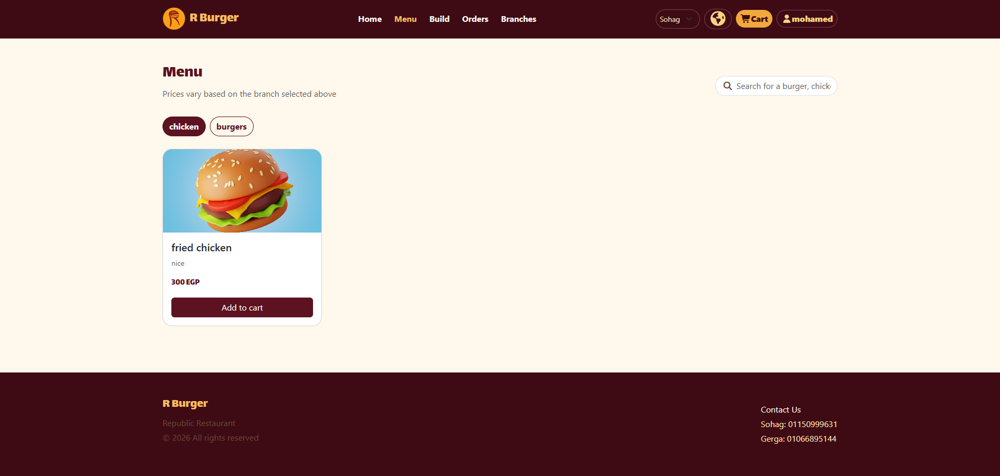

# RB Restaurant

A React-based restaurant application focused on API integration, authentication, state management, and maintainable frontend architecture.

[](https://react.dev/)
[](https://vite.dev/)
[](https://redux-toolkit.js.org/)

**Repository:** [shahendamohamed22/Rb-resturant](https://github.com/shahendamohamed22/Rb-resturant)

## Overview

RB Restaurant is a frontend project built with React and Vite, integrating a backend API to handle application data and authentication workflows.

The project emphasizes separating UI components from business logic, centralizing API communication, and using dedicated tools for client-side state, server data, and form validation.

## Core Implementation

* **API Integration:** Connects the frontend to backend endpoints using a shared Axios client.
* **Authentication:** Integrates login and registration with the backend and manages authentication-related state.
* **Centralized State:** Uses Redux Toolkit to organize shared application state, including user information and authentication data.
* **Server Data Management:** Uses TanStack Query to manage API queries, loading states, and server responses.
* **Branch Selection:** Retrieves branch data from the backend and manages the selected branch.
* **Form Management:** Uses React Hook Form for handling form state and user input.
* **Schema Validation:** Uses Zod to define and validate form data.
* **Routing:** Uses React Router to organize navigation between application views.
* **Internationalization:** Uses i18next to support multilingual interfaces.

## Technology Stack

| Technology      | Role                                   |
| --------------- | -------------------------------------- |
| React 19        | Component-based UI development         |
| Vite            | Development and production builds      |
| Redux Toolkit   | Application state management           |
| TanStack Query  | Server-state management                |
| Axios           | Backend API communication              |
| React Router    | Client-side routing                    |
| React Hook Form | Form handling                          |
| Zod             | Data validation                        |
| SignalR         | Real-time communication infrastructure |
| i18next         | Internationalization                   |
| Bootstrap       | Responsive UI styling                  |
| Font Awesome    | Icons                                  |

## Screenshots

### Home


### Orders


### Branches


### Branches


## Architecture & Code Organization

### Centralized API Client

A shared Axios client keeps API communication organized and avoids repeating the same request configuration throughout the application.

### Separation of Responsibilities

The application uses dedicated tools for different concerns:

* **Components and pages:** Render the user interface.
* **Redux Toolkit:** Manages shared client-side state.
* **TanStack Query:** Handles data retrieved from the backend.
* **API services:** Organize communication with backend endpoints.
* **React Hook Form and Zod:** Handle form state and validation rules.

### Authentication State

Authentication-related information is managed through Redux, making shared user and session data accessible to the relevant parts of the application.

### API-Driven Data

Backend data is retrieved through API requests, allowing the frontend to work with server-provided information rather than relying entirely on hardcoded content.

## Getting Started

### Prerequisites

* Node.js
* npm
* A running backend API

### Installation

Clone the repository:

```bash
git clone https://github.com/shahendamohamed22/Rb-resturant.git
```

Navigate to the project directory:

```bash
cd Rb-resturant
```

Install the dependencies:

```bash
npm install
```

### Environment Variables

Configure the backend API URL in a `.env` file in the project root:

```env
VITE_API_BASE_URL=your_backend_api_url
```

Make sure the variable name matches the one used in the project's Axios configuration.

### Run the Application

Start the development server:

```bash
npm run dev
```

Create a production build:

```bash
npm run build
```


## Key Learning Outcomes

* Integrating frontend applications with REST APIs.
* Structuring API communication using a shared Axios client.
* Managing global state with Redux Toolkit.
* Handling asynchronous server data with TanStack Query.
* Building forms with reusable validation schemas.
* Organizing frontend responsibilities for easier maintenance.
* Working with routing and internationalization in React.

## Author

**Shahenda Mohamed**

[GitHub Profile](https://github.com/shahendamohamed22)

---

*Developed using React, Vite, and modern frontend development tools.*
